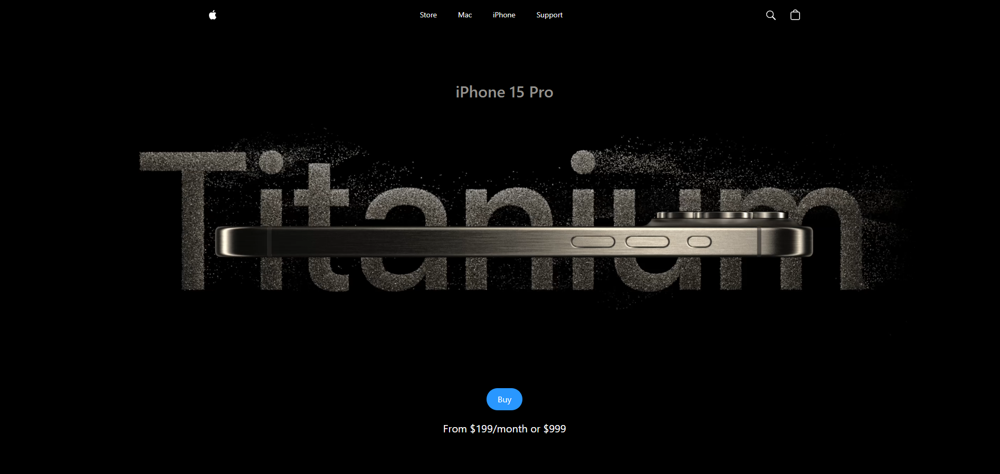
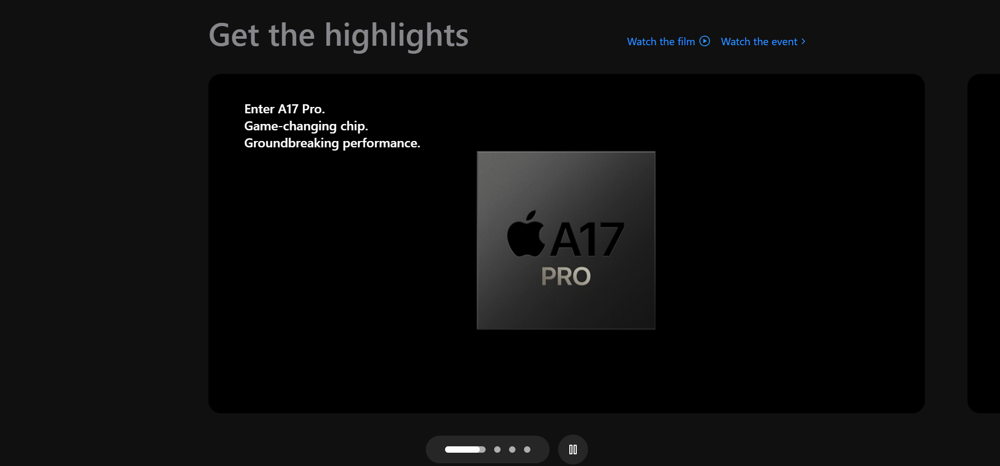
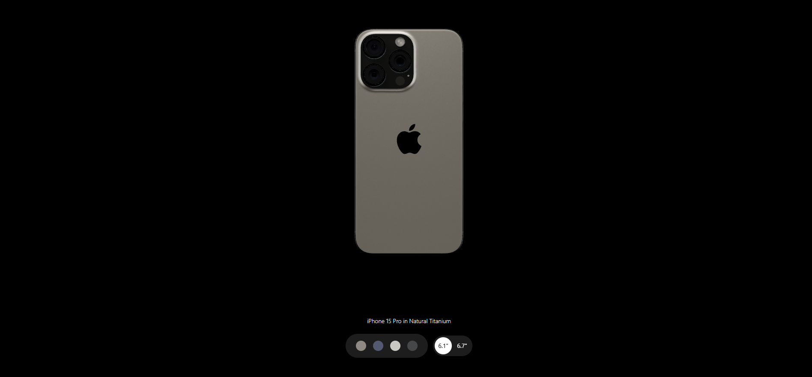

# 🍏 Apple Website Clone

A modern and interactive Apple-style website built with **React**, **Vite**, **Tailwind CSS**, and **Three.js**.

🔗 **Live Preview:** [https://amirznbz.github.io/apple_website/](https://amirznbz.github.io/apple_website/)

---

## ⚙️ Tech Stack

- **React 19**
- **Vite 7**
- **Tailwind CSS 3**
- **Three.js**
- **GSAP** for animations
- **@react-three/fiber** & **@react-three/drei** for 3D rendering
- **Sentry** for error tracking

---

## 🚀 Features

- Smooth page transitions and animations
- Hero section with video background
- Apple-style modern design
- 3D product showcase
- Responsive and mobile-friendly layout

---

## 🛠️ Development

To run the project locally:

```bash
git clone https://github.com/AmirZNBZ/apple_website.git
cd apple_website
npm install
npm run dev
```

```bash
## 📦 Deployment
npm run build
npm run deploy
```

## 📁 Folder Structure
public/
  └── assets/
        ├── images/
        └── models/
src/
  ├── components/
  ├── constants/
  └── utils/

## ✍️ Author

Made with ❤️


```md



